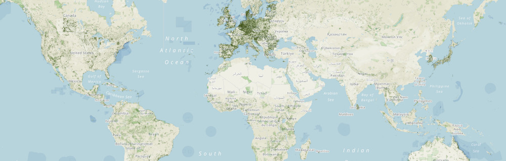

.. image:: https://badge.fury.io/py/pywdpa.svg
   :target: http://badge.fury.io/py/pywdpa
   :alt: PyPI version
	 
.. image:: https://img.shields.io/pypi/pyversions/pywdpa.svg
   :target: https://pypi.org/project/pywdpa
   :alt: Python version
	 
.. image:: https://api.travis-ci.org/ghislainv/pywdpa.svg?branch=master
   :target: https://travis-ci.org/ghislainv/pywdpa
   :alt: Travis CI

.. image:: https://img.shields.io/badge/licence-GPLv3-8f10cb.svg
   :target: https://www.gnu.org/licenses/gpl-3.0.html
   :alt: License GPLv3

``pywdpa`` Python package
=========================
	 

.. include:: ../BASE_README.rst

Content
-------
	     
.. toctree::
   :maxdepth: 1

   references
   changelog

Indices and tables
------------------

* :ref:`genindex`
* :ref:`modindex`
* :ref:`search`

